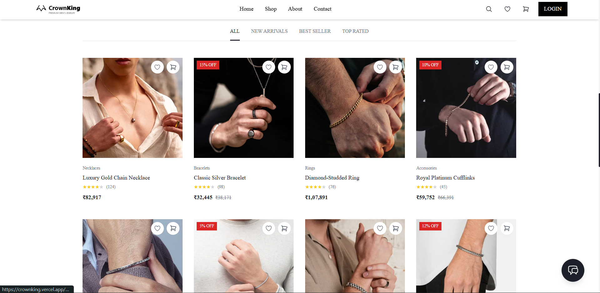
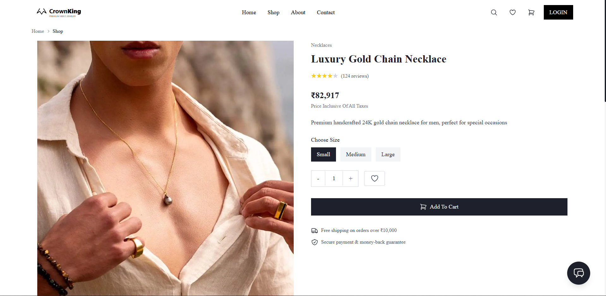
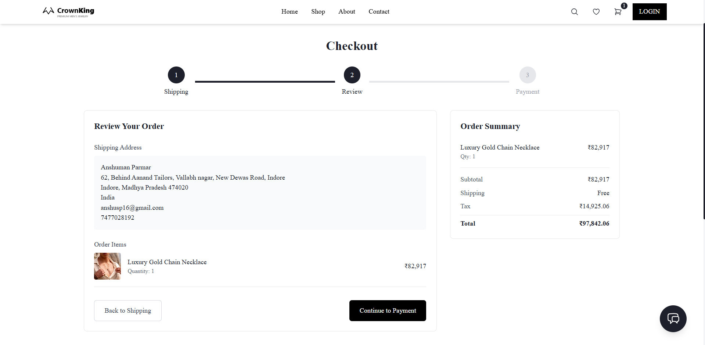
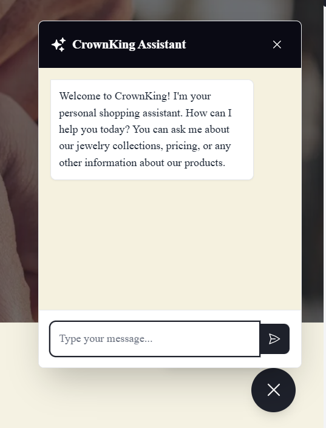
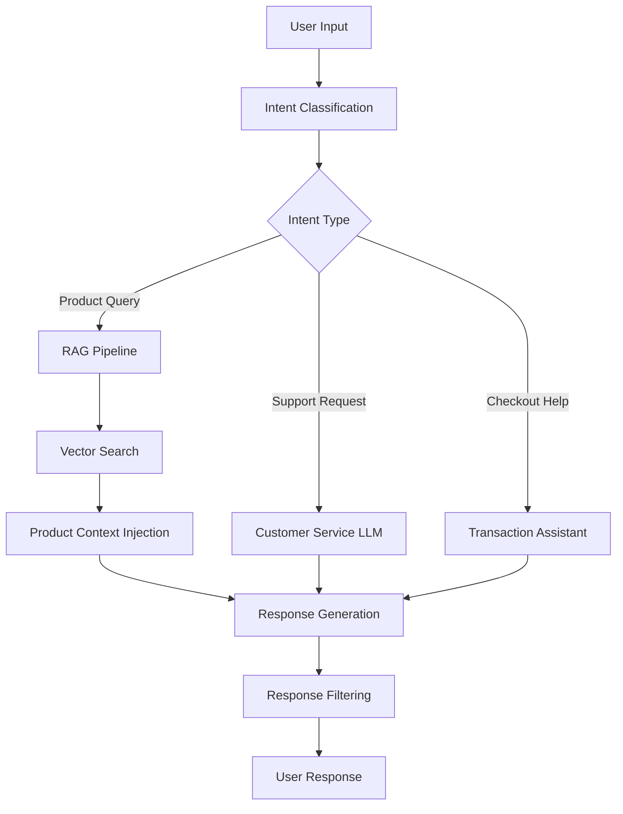

# CrownKing - AI-Powered Premium Jewelry E-commerce Platform


<div align="center">
  
  
  
  
</div>

## 🌟 Showcase

CrownKing represents the convergence of modern e-commerce and artificial intelligence, demonstrating how cutting-edge technologies can elevate the online shopping experience. This project serves as a comprehensive showcase of full-stack AI development applied to a real-world business domain.

## 🤖 AI-First Architecture

This platform is built on an AI-first philosophy, integrating multiple advanced technologies:

- **LLM-Powered Shopping Assistant**: Intelligent chatbot utilizing Large Language Models via Groq's high-performance API
- **Retrieval Augmented Generation (RAG)**: Enhanced customer service with product-aware AI responses
- **Vector Database Integration**: Semantic search capabilities using embeddings for intelligent product recommendations
- **Multi-Modal AI Processing**: Handling text, image, and structured data for comprehensive understanding
- **Real-Time Inference**: Sub-second response times for natural conversational flow
- **Continuous Learning System**: AI models that improve through interaction patterns

## 🚀 Technology Showcase

### Frontend Innovation
- **Next.js 15 App Router**: Server components and streaming for optimized rendering
- **React 19 Concurrent Features**: Leveraging the latest React concurrent mode capabilities
- **Redux Toolkit & RTK Query**: Modern state management with intelligent API caching
- **TanStack Query v5**: Advanced data synchronization and caching
- **Tailwind CSS with Custom Design System**: Utility-first styling with brand-specific extensions
- **Framer Motion & GSAP**: Advanced physics-based animations and micro-interactions
- **TypeScript 5**: Full type safety with strict mode enforcement
- **Styled Components & CSS Modules**: Strategic component styling where appropriate

### State-of-the-Art Backend
- **Express.js with TypeScript**: Strongly-typed API development
- **GraphQL with Apollo Server**: Flexible data querying alongside REST endpoints
- **WebSockets**: Real-time communication for live inventory updates
- **Serverless Functions**: Cloud functions for specific tasks
- **PostgreSQL with Prisma ORM**: Type-safe database interactions with migrations
- **Redis Cache Layer**: High-performance in-memory data store for session and product caching
- **Stripe API with Webhooks**: Comprehensive payment processing with real-time notifications
- **JWT with Refresh Tokens**: Secure, stateless authentication with session refresh

### AI & Machine Learning Stack
- **LangChain Framework**: Composable primitives for AI application development
- **Groq Inference API**: Ultra-fast LLM inference for real-time conversations
- **OpenAI Function Calling**: Structured AI outputs for predictable system integration
- **Pinecone Vector DB**: Similarity search for product recommendations
- **TensorFlow Lite**: On-device ML capabilities for performance optimization
- **HuggingFace Transformers**: Access to state-of-the-art model implementations
- **Custom Fine-Tuned Models**: Domain-adapted models for jewelry expertise
- **LlamaIndex**: Data framework for connecting LLMs with external data

### Cloud & DevOps Excellence
- **Vercel Edge Functions**: Globally distributed serverless compute
- **Docker Containerization**: Consistent environment across development and production
- **CI/CD Pipeline**: GitHub Actions for automated testing and deployment
- **Infrastructure as Code**: Terraform for cloud resource provisioning
- **Monitoring Stack**: Prometheus, Grafana, and Sentry for comprehensive system visibility
- **A/B Testing Framework**: Controlled experiments for UX optimization
- **Performance Monitoring**: Web Vitals tracking with real user monitoring

### Testing & Quality Assurance
- **Jest & React Testing Library**: Component and unit testing
- **Cypress**: End-to-end testing with real browser interaction
- **Playwright**: Cross-browser testing for consistent experiences
- **Storybook**: Component development and documentation
- **ESLint & Prettier**: Code quality and formatting enforcement
- **TypeScript Path Aliases**: Clean import organization
- **Husky & lint-staged**: Pre-commit quality checks

## 🎯 For Business Stakeholders

This platform demonstrates how AI and advanced web technologies deliver tangible business benefits:

- **Conversion Optimization**: Machine learning models identify and enhance high-converting customer journeys
- **Intelligent Customer Insights**: AI-driven analytics reveal shopping patterns and preferences
- **Personalization Engine**: Dynamic product recommendations based on browsing patterns and purchase history
- **Automated Customer Support**: 24/7 AI assistance reducing support overhead while maintaining high satisfaction
- **Fraud Detection**: ML algorithms identifying suspicious transaction patterns
- **Inventory Optimization**: Predictive models for stock management

## ✨ User Experience Innovations

### AI-Enhanced Shopping
- **Voice Search Capability**: Natural language product discovery
- **Virtual Try-On**: AR-based visualization for select jewelry pieces
- **Smart Filtering**: AI-suggested filters based on user preferences
- **Personalized Home Page**: Dynamically assembled based on user behavior
- **Smart Search with NLP**: Understanding natural language queries beyond keywords
- **Cross-Sell Intelligence**: ML-powered related product suggestions

### Conversational Commerce
- **Context-Aware Chat**: Maintains conversation history for meaningful interactions
- **Sentiment Analysis**: Detects customer mood and adjusts tone accordingly
- **Multi-Turn Conversations**: Handles complex queries spanning multiple exchanges
- **Product Knowledge Base**: Deep integration with product catalog and specifications
- **Handoff Protocol**: Seamless transition to human support when needed
- **Proactive Assistance**: Offers help based on detected user hesitation patterns

## 🔍 Technical Deep Dive: AI Implementation

Our chat system represents state-of-the-art AI implementation:



The system utilizes:
- **Query Understanding**: Intent classification to route conversations appropriately
- **Context Management**: Maintaining conversation state across interactions
- **Knowledge Retrieval**: Dynamically accessing relevant product information
- **Response Generation**: Creating natural, helpful responses using LLMs
- **Safety Layer**: Ensuring responses are appropriate and accurate

## 📁 Platform Architecture

Our codebase follows a clean, modular design pattern:

```
crownking/
├── frontend/                 # Next.js frontend application
│   ├── public/               # Static assets and images
│   └── src/                  # Source code
│       ├── app/              # Next.js app router pages
│       ├── components/       # Reusable UI elements
│       ├── hooks/            # Custom React logic
│       ├── store/            # Redux state management
│       ├── api/              # API client and RTK queries
│       ├── types/            # TypeScript definitions
│       ├── utils/            # Helper functions
│       └── ai/               # AI integration components
│
└── backend/                  # Server and business logic
    ├── src/                  # Source code
    │   ├── api/              # API controllers and routes
    │   ├── models/           # Data models and schema
    │   ├── services/         # Business logic services
    │   ├── middleware/       # Express middlewares
    │   ├── utils/            # Utility functions
    │   ├── config/           # Configuration
    │   └── ai/               # AI integration services
        ├── models/           # AI model integrations
        ├── chat/             # Chat processing logic
        ├── embeddings/       # Vector embedding services
        ├── knowledge/        # Knowledge base connections
        └── prompts/          # System prompts and templates
```

## 🚀 Installation

1. Clone the repository
```bash
git clone https://github.com/yourusername/crownking.git
cd crownking
```

2. Install frontend dependencies
```bash
cd frontend
npm install
```

3. Install backend dependencies
```bash
cd ../backend
npm install
```

4. Set up environment variables
   - Create `.env.local` in the frontend directory
   - Create `.env` in the backend directory

5. Set up the database
```bash
cd backend
npx sequelize-cli db:create
npx sequelize-cli db:migrate
npx sequelize-cli db:seed:all
```

6. Run the application
```bash
# Terminal 1 - Backend
cd backend
npm run dev

# Terminal 2 - Frontend
cd frontend
npm run dev
```

7. Open your browser and navigate to `http://localhost:3000`

## 📝 License

This project is licensed under the MIT License

## 👤 Contributors

- [Anshuman Parmar](https://github.com/anshumansp) - Lead Developer

---

**CrownKing** - Where Artificial Intelligence Meets Exceptional Jewelry | An advanced e-commerce platform showcasing the power of AI in online retail 